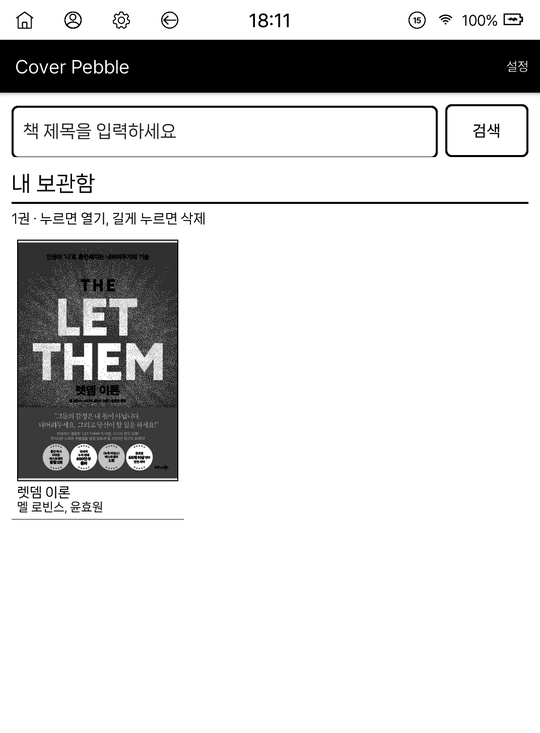
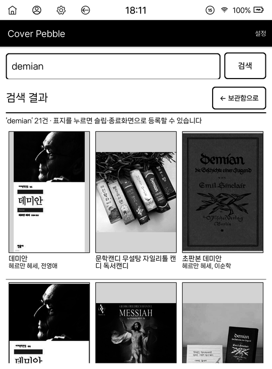
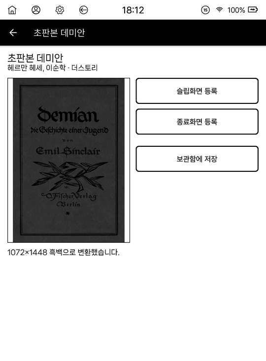
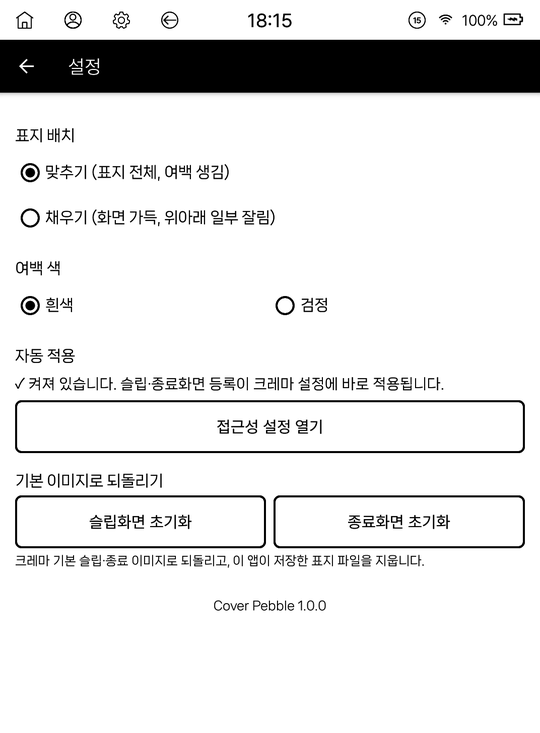

# Cover Pebble

읽고 싶은 책의 표지를 **크레마 페블**의 슬립화면·종료화면으로 바꿔 주는 앱입니다.
책 제목만 검색하면 표지를 찾아 이북리더 화면에 맞게 흑백으로 다듬고, 크레마 설정에 자동으로 적용합니다.

> 현재는 **크레마 페블 전용**입니다. 다른 기기에서는 등록 버튼이 꺼집니다.

| 내 보관함 | 표지 검색 | 슬립·종료화면 등록 | 설정 |
|:---:|:---:|:---:|:---:|
|  |  |  |  |

---

## 1. 설치

[릴리스 페이지](https://github.com/hissinger/cover-pebble/releases/latest)에서 앱 파일(`CoverPebble-1.0.0.apk`)을 받아 페블에 옮겨 설치합니다.

1. 페블을 컴퓨터에 USB로 연결합니다. Mac은 [OpenMTP](https://openmtp.ganeshrvel.com/) 같은 파일 전송 앱이 필요합니다.
2. `CoverPebble-1.0.0.apk`를 페블 내장메모리(예: `Download` 폴더)에 복사합니다.
3. 페블의 파일 관리자에서 APK를 눌러 설치합니다.
   - "출처를 알 수 없는 앱"을 허용하라는 안내가 나오면 허용합니다.
   - "이전 버전의 Android용으로 제작된 앱" 경고가 나오면 그대로 설치하면 됩니다.

## 2. 처음 한 번만: 자동 적용 켜기

Cover Pebble은 크레마 설정 화면을 대신 눌러 표지를 적용합니다. 이를 위해 **접근성 권한**이 한 번 필요합니다.

1. Cover Pebble을 열고 오른쪽 위 **설정**을 누릅니다.
2. **자동 적용 > [접근성 설정 열기]**를 누릅니다.
3. **다운로드한 앱 > Cover Pebble**을 누르고 **사용**을 켭니다. 확인 창이 뜨면 **허용**을 누릅니다.
4. 뒤로 가기로 앱에 돌아오면 "✓ 켜져 있습니다"라고 표시됩니다.

> 이 권한은 크레마 설정 화면에서 슬립·종료 이미지를 고르는 데만 씁니다.

## 3. 사용법

### 표지 찾기
1. 첫 화면 위쪽 입력칸에 **책 제목**을 넣고 **[검색]**을 누릅니다.
2. 검색 결과에서 원하는 표지를 누릅니다.
3. 표지 화면 왼쪽에 실제 화면 크기(1072×1448)로 바꾼 **흑백 미리보기**가 나옵니다.

### 슬립화면·종료화면으로 등록
- **[슬립화면 등록]**: 기기를 잠갔을 때 보이는 화면을 이 표지로 바꿉니다.
- **[종료화면 등록]**: 전원을 껐을 때 보이는 화면을 이 표지로 바꿉니다.

누르면 "이 표지를 ○○화면으로 적용하는 중…" 화면이 잠시 뜨고, 끝나면 앱으로 돌아와 **"✓ 적용했습니다"**가 표시됩니다.

> 적용 중(몇 초)에는 **화면을 누르지 마세요.** 그 뒤에서 크레마 설정을 자동으로 조작하고 있습니다.

### 내 보관함
- 등록한 표지는 첫 화면의 **내 보관함**에 자동으로 모입니다. 다음에는 검색하지 않고 바로 골라 쓸 수 있습니다.
- 등록하지 않고 모아만 두려면 표지 화면에서 **[보관함에 저장]**을 누릅니다.
- 보관함에서 표지를 **길게 누르면** 삭제할 수 있습니다. 표지 화면의 **[보관함에서 삭제]**로도 지울 수 있습니다.
- 보관함에서 지워도 이미 등록한 슬립·종료화면은 그대로입니다.
- 검색 결과를 보다가 **[← 보관함으로]**나 뒤로 가기를 누르면 보관함으로 돌아옵니다.

### 기본 화면으로 되돌리기
**설정 > 기본 이미지로 되돌리기**에서 **[슬립화면 초기화]** 또는 **[종료화면 초기화]**를 누르면, 크레마 기본 이미지로 돌아갑니다.

### 표지 모양 설정
**설정**에서 표지가 화면에 놓이는 방식을 고를 수 있습니다.
- **표지 배치**
  - 맞추기: 표지 전체가 보이고, 남는 곳은 여백
  - 채우기: 화면을 가득 채우고, 위아래가 조금 잘림
- **여백 색**: 맞추기일 때 여백을 흰색 또는 검정으로

## 4. 자주 묻는 질문

**등록 버튼이 눌리지 않아요.**
크레마 페블이 아닌 기기에서는 버튼이 꺼져 있습니다. 표지를 불러오는 중에도 잠시 꺼집니다.

**"접근성에서 'Cover Pebble'을 켜세요"라고 나와요.**
2번(자동 적용 켜기)을 다시 해 주세요. 기기 설정의 앱 정보에서 Cover Pebble을 **강제 종료**하면 안드로이드가 접근성 권한을 자동으로 끕니다.

**"크레마 설정 화면을 끝까지 진행하지 못했습니다"라고 나와요.**
적용 중에 화면을 눌렀거나 기기가 잠들었을 수 있습니다. 다시 눌러 보세요. 계속 안 되면 크레마 설정 > 화면 설정 > 슬립(종료)화면 이미지 > 사용자 지정에서 `bookcover_sleep.png`(`bookcover_poweroff.png`)를 직접 고르면 됩니다.

**검색이 안 돼요.**
Wi-Fi 연결을 확인해 주세요. 표지는 YES24 검색 결과에서 가져옵니다.

**내장메모리 `Wallpaper` 폴더에 파일이 생겼어요.**
`bookcover_sleep.png`, `bookcover_poweroff.png`는 크레마 설정이 표지를 읽어 가는 파일입니다. 등록할 때마다 같은 이름으로 덮어쓰므로 쌓이지 않습니다. 초기화하면 함께 지워집니다.
